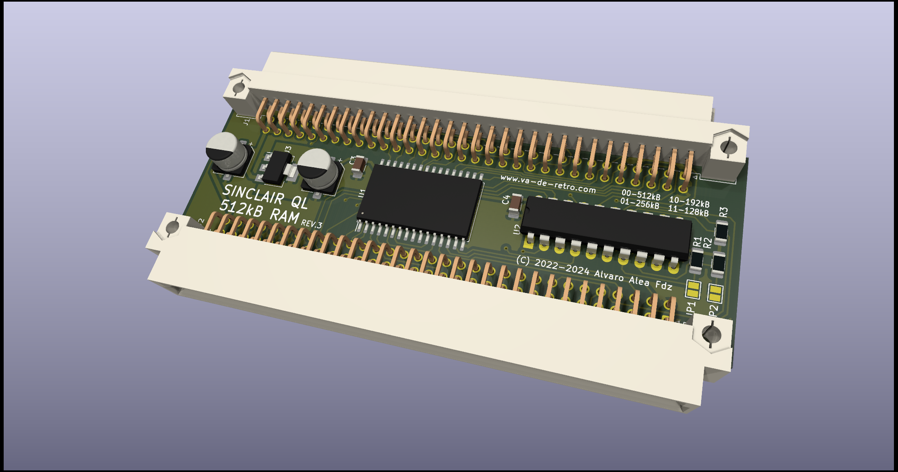

# SINCLAIR QL 512kB External Rom Expansion

(C) 2022 Alvaro Alea Fernandez

License under: CERN Open Hardware Licence Version 2 - Strongly Reciprocal

https://ohwr.org/cern_ohl_s_v2.txt

This is based on the work of McLeod Ideafix, Jose Leandro, Zerover and tcat between others. 

This board will provide aditional 512kB of static RAM (fast-ram) to the sinclair QL.

It is incompatible with any aditional memory expansion on the QL.

Provide a expansion conector to allow conect aditional interfaces.

There area available 4 configuration trough solder jumpers in the PCB.
* 512kB - This is the standar 512kB expansion for any QL
* 256kB - This is for use as a second expansion, use the full QL space for a maximun of 898kB, be aware that this is incompatible with a lot of expansion card, so use with caution (Any expansion card that do not use jumper for configuration will be incompatible).
* 192kB - Similar to 256kB provide aditional space for expansion cards correctly configured.
* 128kB - Similar to 256kB provide aditional space for expansion cards correctly configured.

Be aware that the configuration of 128Kb can not be installed alone.
For be able to use 128kB, for a total of 768kB, is mandatory to have an aditional expansion card that put ROM in address E00000h, in other case the QL ROM will hang indicating RAM malfunction, because a weired overlap of the internal 128kB with this external 128kB.

https://www.instagram.com/p/CZWfWcUM5mx/

In the GAL folder there is the source code for winculp 

 

